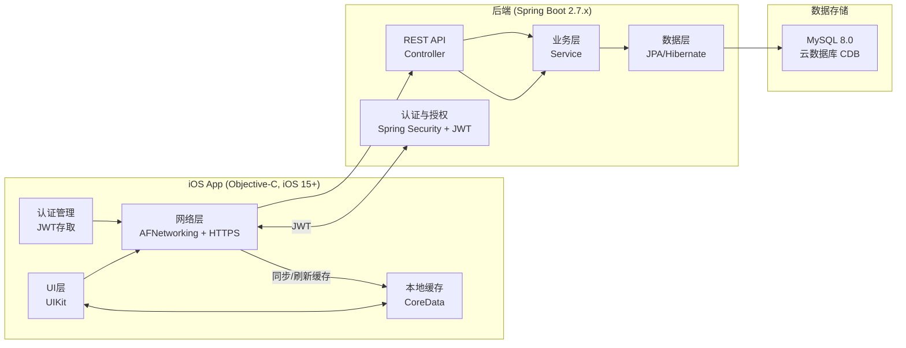
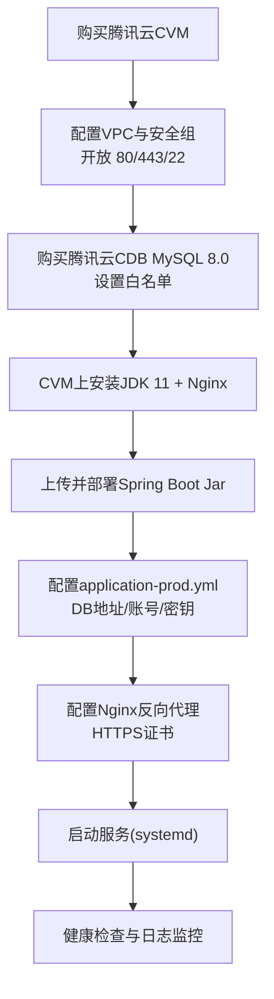

**用户管理APP完整架构方案**

**概述**
本方案面向 iOS 原生客户端（Objective-C, iOS 15+）与 Java 后端（Spring Boot 2.7.x）的前后端分离应用，覆盖注册、登录、查询、修改与 JWT 认证，后端 MySQL 8.0 存储，前端 CoreData 缓存，部署在腾讯云 CVM + CDB MySQL。

**架构图**


**技术栈清单**
- iOS 客户端
- iOS 15+ / Objective-C
- Xcode 15.x
- UIKit
- 网络：AFNetworking 4.0.1
- JSON：YYModel 1.0.4 或 NSJSONSerialization
- 本地缓存：CoreData
- 安全：Keychain（保存 JWT/Refresh Token）

- 后端
- Java 11
- Spring Boot 2.7.x
- Spring Web MVC 5.3.x
- Spring Security 5.7.x
- JWT：jjwt 0.11.5
- ORM：Spring Data JPA + Hibernate 5.6.x
- MySQL Driver：mysql-connector-j 8.0.33
- 连接池：HikariCP
- 数据库迁移：Flyway 9.x（推荐）

- 部署
- 腾讯云 CVM（CentOS 7/8 或 Ubuntu 20.04）
- 腾讯云 CDB MySQL 8.0
- Nginx 1.20+
- JDK 11
- 进程管理：systemd 或 supervisor

**接口文档（RESTful）**
统一返回结构：
```json
{
  "code": 0,
  "message": "ok",
  "data": {}
}
```

错误示例：
```json
{
  "code": 40001,
  "message": "invalid credentials",
  "data": null
}
```

API 列表（/api/v1）：

1. POST /auth/register
- 说明：用户注册
- 请求体：
```json
{
  "phone": "13800000000",
  "password": "P@ssw0rd",
  "nickname": "Alice"
}
```
- 返回：
```json
{
  "code": 0,
  "message": "ok",
  "data": {
    "userId": 123,
    "phone": "13800000000",
    "nickname": "Alice",
    "createdAt": "2026-03-20T10:00:00Z"
  }
}
```

2. POST /auth/login
- 说明：手机号+密码登录
- 请求体：
```json
{
  "phone": "13800000000",
  "password": "P@ssw0rd"
}
```
- 返回：
```json
{
  "code": 0,
  "message": "ok",
  "data": {
    "accessToken": "JWT_ACCESS_TOKEN",
    "tokenType": "Bearer",
    "expiresIn": 7200,
    "refreshToken": "JWT_REFRESH_TOKEN"
  }
}
```

3. GET /users/me
- 说明：获取当前用户信息
- Header：Authorization: Bearer <accessToken>
- 返回：
```json
{
  "code": 0,
  "message": "ok",
  "data": {
    "userId": 123,
    "phone": "13800000000",
    "nickname": "Alice",
    "avatarUrl": "https://...",
    "updatedAt": "2026-03-20T12:00:00Z"
  }
}
```

4. PUT /users/me
- 说明：修改用户信息
- Header：Authorization: Bearer <accessToken>
- 请求体（可选字段）：
```json
{
  "nickname": "Alice Zhang",
  "avatarUrl": "https://..."
}
```
- 返回：
```json
{
  "code": 0,
  "message": "ok",
  "data": {
    "userId": 123,
    "phone": "13800000000",
    "nickname": "Alice Zhang",
    "avatarUrl": "https://...",
    "updatedAt": "2026-03-20T13:00:00Z"
  }
}
```

5. POST /auth/refresh
- 说明：刷新 Access Token
- 请求体：
```json
{
  "refreshToken": "JWT_REFRESH_TOKEN"
}
```
- 返回：
```json
{
  "code": 0,
  "message": "ok",
  "data": {
    "accessToken": "NEW_ACCESS_TOKEN",
    "tokenType": "Bearer",
    "expiresIn": 7200
  }
}
```

**数据库表设计（MySQL 8.0）**
```sql
CREATE TABLE `users` (
  `id` BIGINT UNSIGNED NOT NULL AUTO_INCREMENT COMMENT '主键',
  `phone` VARCHAR(20) NOT NULL COMMENT '手机号',
  `password_hash` VARCHAR(100) NOT NULL COMMENT 'BCrypt哈希',
  `nickname` VARCHAR(50) DEFAULT NULL COMMENT '昵称',
  `avatar_url` VARCHAR(255) DEFAULT NULL COMMENT '头像',
  `status` TINYINT NOT NULL DEFAULT 1 COMMENT '状态 1正常 0禁用',
  `created_at` DATETIME NOT NULL DEFAULT CURRENT_TIMESTAMP,
  `updated_at` DATETIME NOT NULL DEFAULT CURRENT_TIMESTAMP ON UPDATE CURRENT_TIMESTAMP,
  PRIMARY KEY (`id`),
  UNIQUE KEY `uk_phone` (`phone`)
) ENGINE=InnoDB DEFAULT CHARSET=utf8mb4;
```

可选表（更安全的刷新与注销）：
```sql
CREATE TABLE `refresh_tokens` (
  `id` BIGINT UNSIGNED NOT NULL AUTO_INCREMENT,
  `user_id` BIGINT UNSIGNED NOT NULL,
  `token` VARCHAR(255) NOT NULL,
  `expires_at` DATETIME NOT NULL,
  `revoked` TINYINT NOT NULL DEFAULT 0,
  `created_at` DATETIME NOT NULL DEFAULT CURRENT_TIMESTAMP,
  PRIMARY KEY (`id`),
  UNIQUE KEY `uk_token` (`token`),
  KEY `idx_user_id` (`user_id`)
) ENGINE=InnoDB DEFAULT CHARSET=utf8mb4;
```

**JWT 与注销策略**
- 方案 A（推荐，Redis 黑名单）
- JWT 带 jti
- 退出时将 jti 写入 Redis，TTL 为 token 剩余有效期
- 校验时验签 + 查 Redis 黑名单

- 方案 B（无 Redis，tokenVersion）
- users 表增加 token_version
- JWT 带 tokenVersion
- 修改密码或退出时 token_version + 1

**安全与合规建议**
- 密码存储使用 BCrypt
- 登录接口加 IP 级限流
- 强制 HTTPS
- 日志手机号脱敏（前三后四）

**日志、监控、告警**
- 应用日志：logback-spring.xml，建议 JSON 格式
- 访问日志：Nginx access_log
- JVM 监控：Spring Boot Actuator + Micrometer
- 告警：5xx 比例上升、认证失败率异常、连接池耗尽

**application-prod.yml 模板**
```yaml
server:
  port: 8080

spring:
  datasource:
    url: jdbc:mysql://<CDB_HOST>:3306/userdb?useUnicode=true&characterEncoding=utf8&useSSL=false&serverTimezone=Asia/Shanghai
    username: <DB_USER>
    password: <DB_PASS>
    driver-class-name: com.mysql.cj.jdbc.Driver
    hikari:
      maximum-pool-size: 20
      minimum-idle: 5
      connection-timeout: 30000

  jpa:
    hibernate:
      ddl-auto: validate
    show-sql: false
    properties:
      hibernate:
        format_sql: false

jwt:
  secret: <JWT_SECRET>
  access-token-expire-seconds: 7200
  refresh-token-expire-seconds: 2592000

logging:
  level:
    root: INFO
    com.yourapp: INFO
```

**Nginx 反向代理示例**
```nginx
server {
  listen 80;
  server_name api.yourdomain.com;

  location / {
    proxy_pass http://127.0.0.1:8080;
    proxy_set_header Host $host;
    proxy_set_header X-Real-IP $remote_addr;
    proxy_set_header X-Forwarded-For $proxy_add_x_forwarded_for;
  }
}
```

**systemd 启动脚本示例**
```ini
[Unit]
Description=UserApp Backend
After=network.target

[Service]
User=appuser
WorkingDirectory=/opt/userapp
ExecStart=/usr/bin/java -jar /opt/userapp/userapp.jar --spring.profiles.active=prod
Restart=always
SuccessExitStatus=143

[Install]
WantedBy=multi-user.target
```

**iOS CoreData 缓存设计**
- Entity: CDUser
- 字段
- userId (Integer64)
- phone (String)
- nickname (String)
- avatarUrl (String)
- updatedAt (Date)

缓存策略：
- 启动先读本地
- 拉取成功后覆盖写入
- updatedAt 比较，避免回退

**推荐的后端包结构**
- controller
- service
- repository
- domain
- security
- config

**错误码规范**
- 40001 参数校验失败
- 40101 未登录或 token 无效
- 40301 权限不足
- 40401 资源不存在
- 50001 服务器异常

**Spring Security + JWT 关键骨架（示意）**
```java
@Configuration
@EnableWebSecurity
@RequiredArgsConstructor
public class SecurityConfig {

  private final JwtAuthFilter jwtAuthFilter;
  private final UserDetailsService userDetailsService;

  @Bean
  public SecurityFilterChain filterChain(HttpSecurity http) throws Exception {
    http
      .csrf().disable()
      .cors().and()
      .sessionManagement().sessionCreationPolicy(SessionCreationPolicy.STATELESS).and()
      .authorizeRequests()
        .antMatchers("/api/v1/auth/**", "/v3/api-docs/**", "/swagger-ui/**").permitAll()
        .anyRequest().authenticated().and()
      .userDetailsService(userDetailsService)
      .exceptionHandling()
        .authenticationEntryPoint((req, res, ex) -> {
          res.setStatus(HttpServletResponse.SC_UNAUTHORIZED);
          res.setContentType("application/json;charset=UTF-8");
          res.getWriter().write("{\"code\":40101,\"message\":\"unauthorized\"}");
        });

    http.addFilterBefore(jwtAuthFilter, UsernamePasswordAuthenticationFilter.class);
    return http.build();
  }

  @Bean
  public PasswordEncoder passwordEncoder() {
    return new BCryptPasswordEncoder();
  }
}
```

**iOS 网络层骨架（示意）**
```objective-c
@interface APIClient : AFHTTPSessionManager
+ (instancetype)shared;
- (void)requestWithMethod:(NSString *)method
                      URL:(NSString *)URL
               parameters:(NSDictionary *)params
               completion:(void (^)(id _Nullable data, NSError *_Nullable error))completion;
@end
```

**部署流程图（腾讯云）**

